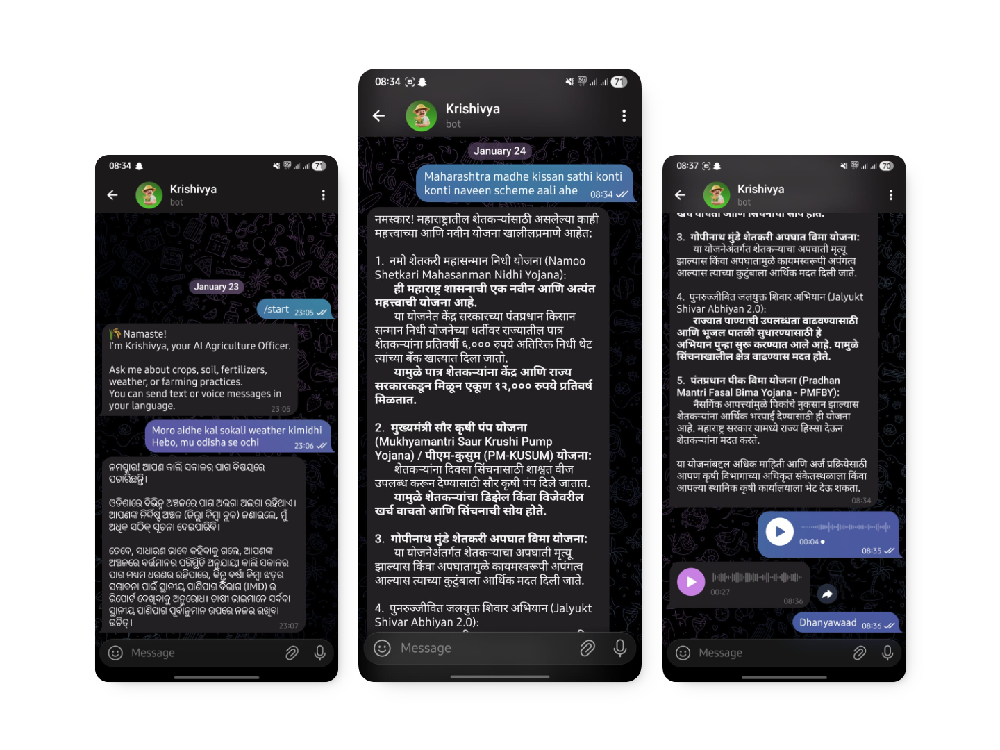

#  Krishivya bot

This is a Telegram bot that helps farmers with their queries.

## Features

| Feature | Description |
| --- | --- |
| **RAG Based** | The bot uses a Retrieval-Augmented Generation model to provide accurate and context-aware answers to farming queries. |
| **Multimodal** | Krishivya can understand and analyze both text and image inputs, allowing farmers to send pictures of their crops for diagnosis. |
| **Multilingual** | The bot is designed to be multilingual, automatically detecting the user's language and responding in the same language. |
| **Voice Interaction** | Users can send voice messages, and the bot will reply with a voice message, making it accessible for all users. |
| **Reminders** | Farmers can set reminders for important tasks, and the bot will send a notification at the scheduled time. |

## License

This project is licensed under the MIT License. See the [LICENSE](LICENSE) file for details.

---